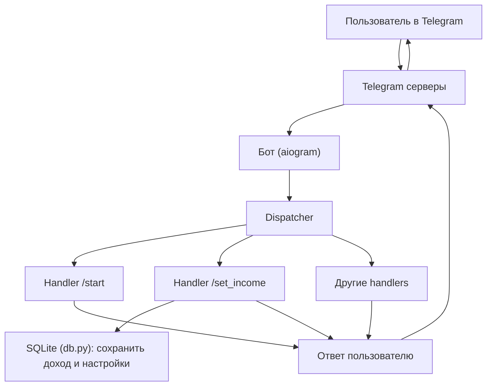

# Саммари за 2026-03-22

## Что сделали сегодня
1. Зафиксировали формат работы и правила взаимодействия в `WORKFLOW_RULES.md`.
2. Уточнили, что делаем именно Telegram-бота (не Slack).
3. Подняли окружение проекта: создали `.venv`, установили зависимости (`aiogram`, `python-dotenv`, `aiosqlite`, `apscheduler`).
4. Создали базовую структуру проекта и основные файлы.
5. Добавили `.env` и `requirements.txt`.
6. В `config.py` сделали функцию чтения токена из `.env`.
7. В `main.py` собрали базовый запуск бота: получение токена, проверка токена, создание `Bot` и `Dispatcher`, запуск polling.
8. Добавили подробные комментарии к `main.py` для обучения.
9. Разобрали ключевые понятия: `Bot`, `Dispatcher`, `handler`, `polling`, `async/await`, `__name__ == "__main__"`, класс и объект, высокоуровневый/низкоуровневый подход.
10. Настроили Git:
   - добавили `.gitignore` (исключили `.env`, `.venv`, `__pycache__`),
   - сделали первый коммит.
11. Подключили GitHub-репозиторий и опубликовали проект: https://github.com/Ol1kk/Bot_counter

## Как работает Telegram-бот (схема)

### Как читать эту схему
1. Пользователь отправляет сообщение в Telegram.
2. Telegram передает обновление (update) боту.
3. Бот через polling получает update.
4. Dispatcher выбирает подходящий handler.
5. Handler выполняет логику (иногда читает/пишет в БД).
6. Бот отправляет ответ пользователю.

### Роли файлов в проекте
1. `main.py` — запуск бота (`Bot`, `Dispatcher`, polling).
2. `handlers.py` — обработка команд и сообщений.
3. `db.py` — хранение данных пользователя.
4. `config.py` — чтение настроек и токена из `.env`.

## Текущий статус проекта
- Базовый каркас проекта готов.
- Точка входа в `main.py` настроена.
- Следующий практический шаг: сделать хэндлер `/start` и проверить ответ бота в Telegram.

## План на следующий шаг
1. Заполнить `handlers.py` простым обработчиком `/start`.
2. Подключить роутер в `main.py`.
3. Запустить `python main.py`.
4. Проверить в Telegram, что бот отвечает на `/start`.

## Backlog на после MVP
- Добавить историю доходов: сохранять не только сумму дохода, но и дату, с которой этот доход действует.
- Для истории лучше сделать отдельную таблицу, где каждая новая сумма дохода добавляется новой записью, а не перезаписывает старую.
- Добавить кнопки в `/start`: показать reply-клавиатуру с командами `/set_income` и `/daily_salary`, чтобы пользователь мог нажимать, а не вводить команды руками.
- Добавить календарь праздничных и рабочих дней, чтобы расчет зарплаты учитывал реальные рабочие дни месяца.
- Добавить автоматическое ежедневное сообщение: бот сам пишет пользователю в заданное время, сколько она заработала сегодня.
